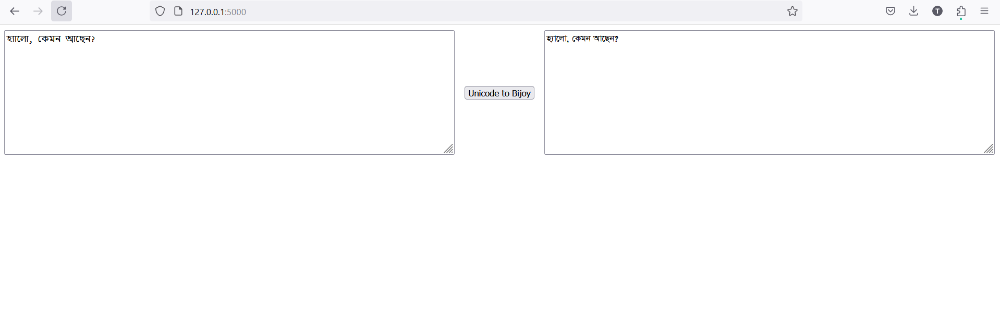

# Converting Bengali Unicode language to Bijoy Bangla

This project is completed with Flask framework to give a simple UI to convert Bengali Unicode to Bijoy. 

## What I learned in this project :
- How Template Engines work in Flask Framework.
- How to use Flask Framework.
- Logical differences and Mapping of Unicode and  Bijoy 

## Prerequisites

- Python 3.12.0
- Any Browser

## Instructions

### 1. Install Python

Ensure you have Python installed on your machine. You can download Python from [python.org](https://www.python.org/downloads/).

### 2. Create a Virtual Environment

Create a virtual environment to manage your project dependencies.

```bash
# Navigate to your project directory
cd path/to/your/project

# Create a virtual environment named 'coupang'
python -m venv convertApp
```
### 3. Activate Virtual Environment

```bash
# On Windows
.\convertApp\Scripts\activate


# On macOS/Linux
source convertApp/bin/activate
```

### 4. Install Requirements
```bash
pip install -r requirements.txt
```

### 5. Run the main script to run the flask application

```bash
python converter.py
```
### 6. Go to browser and visit http://127.0.0.1:5000/
The application will take input from user and convert Bengali Unicode to Bijoy Bangla when the button is clicked. Image is added for reference



