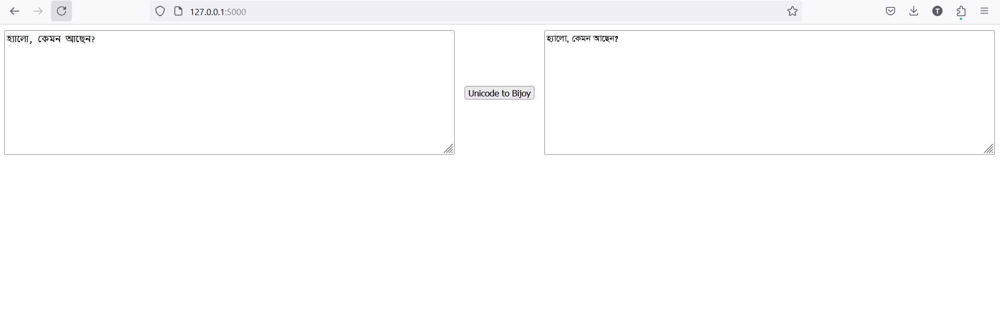

---

# Unicode to Bijoy Bangla Converter

This project provides a simple UI to convert Bengali Unicode text to Bijoy Bangla. Originally built using Flask, it has now been migrated to FastAPI and dockerized for easier deployment and portability.

## What I Learned in This Project

- How template engines work with web frameworks.
- The differences between Flask and FastAPI.
- Logical differences and mapping between Unicode and Bijoy encodings.
- How to containerize a web application using Docker.

## Prerequisites

- [Docker](https://docs.docker.com/get-docker/) installed on your machine.
- A web browser.

## Instructions

### 1. Clone the Repository

Clone this repository to your local machine:

```bash
git clone https://github.com/dstushar7/converter.thetechguybd.com.git
cd converter.thetechguybd.com
```

### 2. Build the Docker Image

Build the Docker image using the provided Dockerfile. You can tag the image with a name that reflects its purpose:

```bash
docker build -t unicode-to-bijoy-converter .
```

### 3. Run the Docker Container

Run the Docker container, mapping port 8000 inside the container to port 8000 on your host:

```bash
docker run -p 8000:8000 unicode-to-bijoy-converter
```

### 4. Access the Application

Open your web browser and visit:

```
http://localhost:8000
```

The application will display a UI where you can input Bengali Unicode text and convert it to Bijoy Bangla when you click the conversion button.


## You can also directly pull the project from DockerHub :
Below are the Docker run commands. You can pull the image from Docker Hub (dstushar7/unicode-to-converter) and run it as follows:

```bash
# Pull the image from Docker Hub
docker pull dstushar7/unicode-to-bijoy-converter:latest

# Run the Docker container mapping port 8000
docker run -p 8000:8000 dstushar7/unicode-to-bijoy-converter:latest
```

Once the container is running, open your browser and navigate to [http://localhost:8000](http://localhost:8000) to access the application.

---

## Project Structure

A typical folder structure for this project is:

```
converter.thetechguybd.com/
├── app/
│   ├── __init__.py
│   ├── main.py               # FastAPI app entrypoint
│   ├── api/                  # All route handlers
│   │   ├── __init__.py
│   │   └── routes.py         # All endpoints
│   ├── services/             # Business logic
│   │   ├── __init__.py
│   │   ├── convert_util.py
│   │   └── convert.py
│   ├── static/               # Static files
│   │   ├── script.js
│   │   ├── styles.css
│   │   └── SutonnyMJ.ttf
│   ├── templates/            # HTML templates
│       └── index.html
├── Dockerfile
├── requirements.txt
└── README.md   
```

---

## Screenshots

Below is a screenshot of the working application:



---

With these instructions, you can now build, run, and share your Unicode to Bijoy Bangla Converter using Docker. Enjoy converting!
